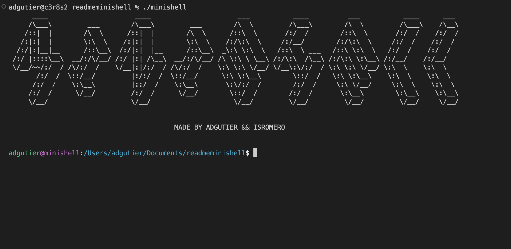

# Minishell :shell:

## Descripción :page_facing_up:

Minishell es un proyecto desarrollado por [amsteradri](https://github.com/amsteradri) y [isromero](https://github.com/isromero) . 
El proyecto Minishell es una fascinante iniciativa de ingeniería de software diseñada para emular las funcionalidades fundamentales de una terminal UNIX. A través de este proyecto, los desarrolladores buscan adentrarse en los principios operativos subyacentes de los sistemas operativos, especialmente en lo que respecta al manejo de procesos, la interacción con el sistema de archivos y la interpretación de comandos. El objetivo principal es crear una shell minimalista que ofrezca una experiencia de usuario similar a la de Bash, uno de los intérpretes de comandos más extendidos en entornos UNIX y Linux.
## Características :star:

- :computer: Ejecución de comandos en el PATH y comandos built-in.
- :gear: Gestión de variables de entorno.
- :arrow_right: Soporte para redirecciones (`>`, `>>`, `<`) y pipes (`|`).
- :memo: Implementación de algunas características propias de shells como historial de comandos o autocompletado (si se incluyeron).
- :signal_strength: Manejo de señales y asignación de trabajo.

## Cómo descargar :arrow_down:

Para descargar y compilar Minishell, sigue los siguientes pasos en tu terminal:

```bash
# Clonar el repositorio
git clone https://github.com/isromero/minishell.git

# Cambiar al directorio del proyecto
cd minishell

# Compilar el proyecto (ajusta según el sistema de compilación que utilices)
make
```
## Cómo usar :computer:

Una vez compilado, puedes ejecutar Minishell con el siguiente comando:

```bash
./minishell
```
Ahora estás en tu Minishell, donde puedes empezar a ejecutar comandos como lo harías en cualquier otra shell. Para salir, puedes utilizar el comando `exit`.

## 👥 Créditos
- [isromero's GitHub](https://github.com/isromero)
- [amsteradri's GitHub](https://github.com/amsteradri)
